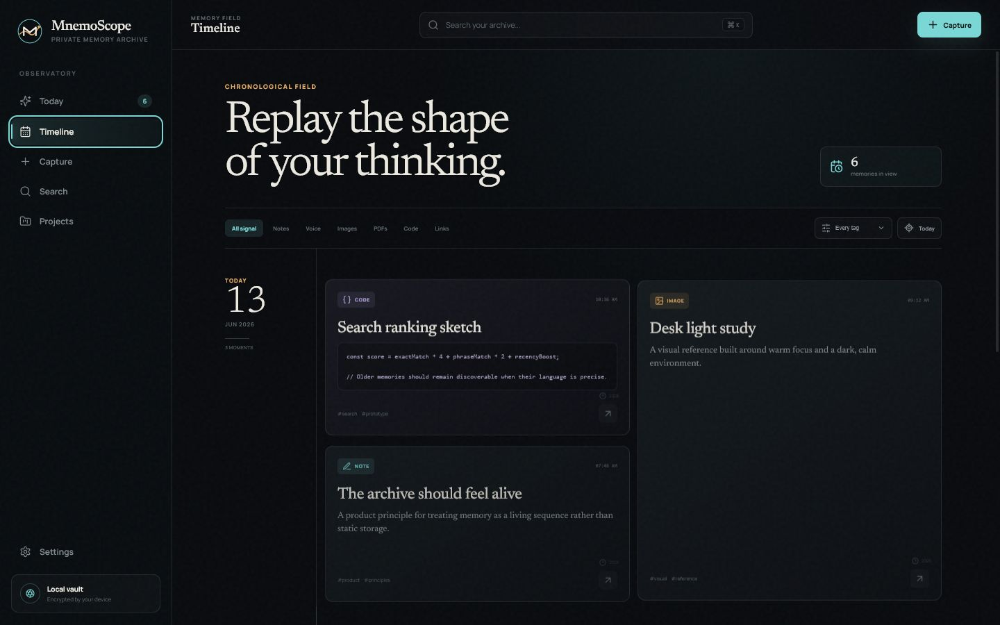
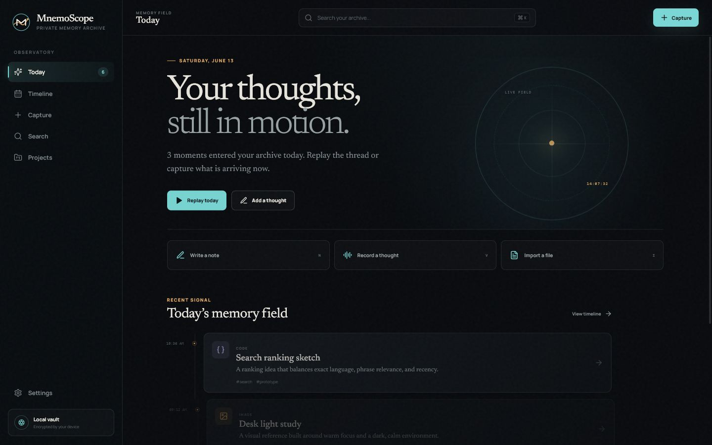
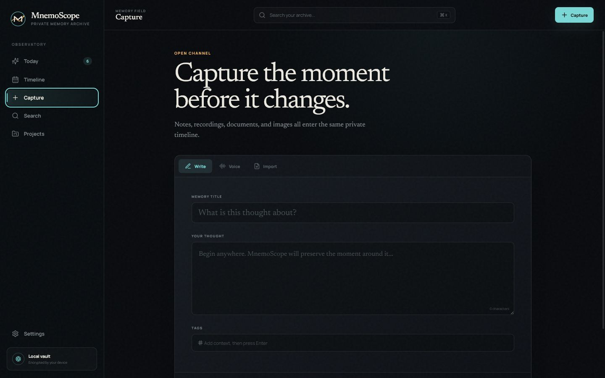
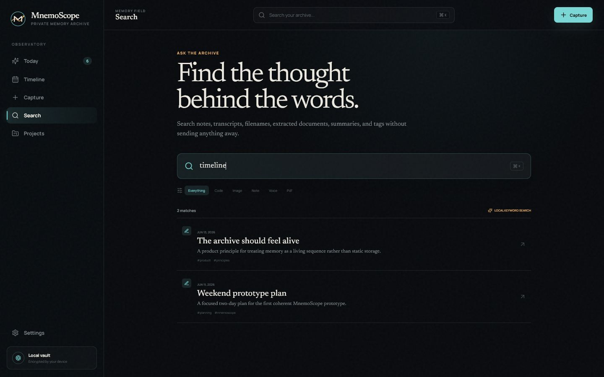

<div align="center">


### Replay your thoughts. Rediscover your ideas.

A cinematic, local-first memory timeline for notes, screenshots, voice thoughts,
PDFs, code snippets, and the half-formed ideas that deserve another look.

</div>

---



## Why MnemoScope

Folders preserve outcomes. They rarely preserve the path that produced them.

MnemoScope keeps the path visible. Every note, image, recording, document, and
snippet becomes a moment on a chronological field. You can replay a day, search
across extracted text, reopen the context around an idea, and turn a group of
memories into a clean project brief.

The application is designed to feel less like a filing cabinet and more like an
observatory for your own thinking.

## What It Does

- **Cinematic timeline** grouped by day, with type and tag filters
- **Fast capture** for notes and voice thoughts
- **Drag-and-drop import** for text, Markdown, code, PDF, and image files
- **PDF text extraction** loaded only when a PDF is imported
- **Local search** across titles, content, summaries, filenames, tags, and transcripts
- **Memory capsules** with full content, related memories, summaries, copy, and delete actions
- **Local summaries** using an extractive fallback provider with no API key
- **Daily synthesis** that reads a group of memories as one continuous day
- **Markdown project briefs** ready for GitHub, Obsidian, Notion, or a research notebook
- **SQLite persistence** in the Tauri desktop application
- **Browser fallback** using local storage for the web preview
- **JSON vault backup** from Settings
- **Two dark themes**, responsive layouts, keyboard timeline navigation, and reduced-motion support

## Screens

| Command center | Capture |
| :---: | :---: |
|  |  |

| Timeline | Search |
| :---: | :---: |
|  |  |

## File Support

| Kind | Extensions | Behavior |
| :--- | :--- | :--- |
| Text | `.txt`, `.md` | Full text indexing |
| Code | `.js`, `.ts`, `.tsx`, `.py`, `.rs`, `.cpp`, `.java`, `.css`, `.html`, `.json` | Code preview and full text indexing |
| PDF | `.pdf` | Local text extraction with PDF.js |
| Images | `.png`, `.jpg`, `.jpeg`, `.webp` | Visual memory card and embedded preview |
| Other files | Any | Metadata memory with a useful fallback state |

Voice recording uses `MediaRecorder`. Live transcription is enabled where a
compatible browser speech-recognition API exists; a manual transcript field is
always available.

## Stack

- [Tauri 2](https://tauri.app/) for the native desktop shell
- [React 19](https://react.dev/) and TypeScript for the interface
- [Vite 8](https://vite.dev/) for development and production builds
- [SQLite](https://sqlite.org/) through `rusqlite` for native persistence
- [Zustand](https://zustand.docs.pmnd.rs/) for application state
- [Motion](https://motion.dev/) for restrained transitions
- [PDF.js](https://mozilla.github.io/pdf.js/) for local PDF extraction
- Lucide icons, Manrope Variable, and Newsreader Variable

## Start Developing

Requirements:

- Node.js 20.19+ or 22.12+
- Rust stable
- Platform prerequisites from the [Tauri guide](https://v2.tauri.app/start/prerequisites/)

```bash
npm install
npm run dev
```

The browser preview opens at `http://localhost:1420`. It uses browser local
storage so the main workflows remain testable without launching the native
shell.

To run the desktop application:

```bash
npm run tauri dev
```

## Verify the Project

```bash
npm run lint
npm run typecheck
npm run build
cargo test --manifest-path src-tauri/Cargo.toml
```

The Rust test covers migrations, demo seeding, tag relationships, updates, and
FTS synchronization.

## Build the Desktop App

```bash
npm run tauri build
```

Tauri writes native bundles beneath:

```text
src-tauri/target/release/bundle/
```

The exact installer type depends on the host platform. On Windows, the current
configuration produces NSIS and MSI packages.

Prebuilt Windows 0.1.0 installers and SHA-256 checksums are also tracked in
[`dist-installers`](./dist-installers/).

## Project Structure

```text
src/
|-- app/                 Application composition
|-- assets/brand/        Logo, mark, wordmark, and icon source
|-- components/
|   |-- capture/         File drop, note, and voice capture
|   |-- export/          Markdown brief preview and download
|   |-- layout/          Sidebar, command bar, and shell
|   |-- memory/          Cards, type badges, and detail drawer
|   |-- timeline/        Day groups and replay layout
|   `-- ui/              Shared presentation primitives
|-- features/            Screen-level product experiences
|-- lib/
|   |-- ai/              Provider contract and local fallback
|   |-- import/          File and PDF extraction
|   `-- memory/          Models, demo data, and repository
|-- stores/              Memory and preference state
`-- styles/              Global visual system

src-tauri/
|-- capabilities/        Native permission declarations
|-- icons/               Generated application icon set
`-- src/database.rs      SQLite schema, commands, and tests
```

## Local-First by Design

MnemoScope makes no network request in its default configuration. Desktop
memories live in `mnemoscope.sqlite3` inside the operating system's application
data directory. The browser preview uses local storage.

The current MVP does **not** apply its own database encryption. Protection is
provided by your operating system account and any device-level encryption you
have enabled. Exported JSON backups contain readable memory content and should
be handled accordingly.

The summary provider interface is intentionally separate from the product
features, so an opt-in semantic or hosted provider can be added later without
rewriting capture, search, or export.

## Keyboard Notes

- `Ctrl/Cmd + K` opens Search
- `Arrow Up` and `Arrow Down` travel between filtered timeline memories
- `Escape` closes an open memory capsule

## Roadmap

- Semantic search through an explicit opt-in provider
- Encrypted vault mode
- Native file copies and durable media attachments
- Obsidian import and export
- Global quick-capture shortcut
- Browser clipper
- Connected-memory graph
- Calendar replay view
- Optional local language model provider

## Brand

The MnemoScope mark combines a memory-wave `M`, a scope ring, and an amber
timeline signal. Source assets and usage notes live in
[`src/assets/brand`](./src/assets/brand/).

## License

MnemoScope is available under the [MIT License](./LICENSE).
